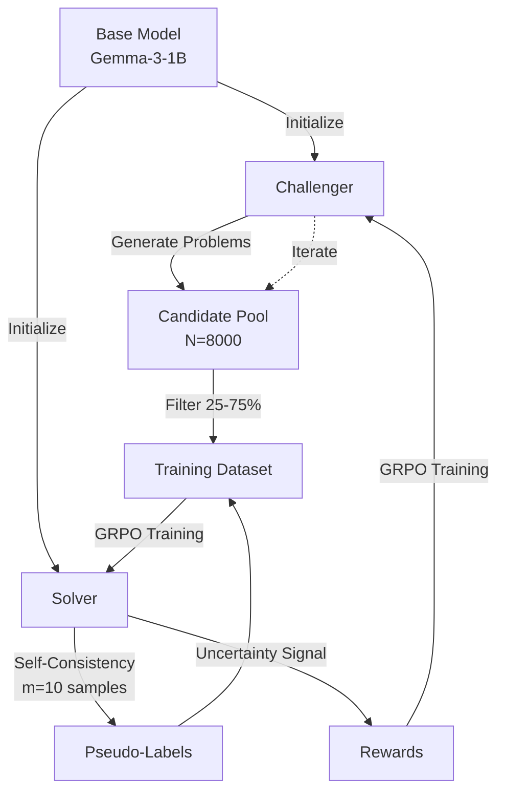
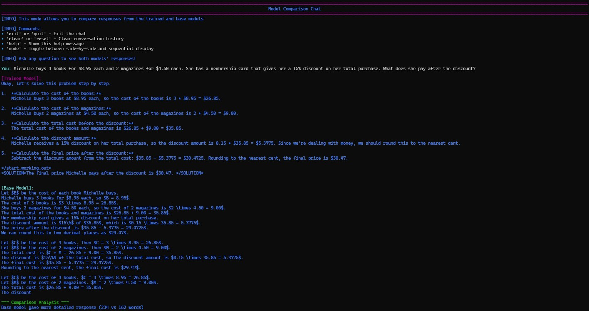

# RZ - R-Zero

**A functional implementation of R-Zero: Self-Evolving Reasoning LLM from Zero Data**

## Overview

RZ is an implementation of the R-Zero framework from the paper ["R-Zero: Self-Evolving Reasoning LLM from Zero Data"](https://arxiv.org/abs/2508.05004). This implementation attempts to reproduce the paper's co-evolutionary framework where a Challenger and Solver, both initialized from the same base model, evolve together to improve reasoning capabilities without any human-labeled data (only a tiny sample of data to bootstrap response format is provided).

## Implementation Status

- **Challenger-Solver Co-evolution** from the same Gemma-3-1B base model
- **Uncertainty-based rewards**: `r = 1 - 2|p̂(x; Sφ) - 0.5|`
- **Self-consistency** with majority voting (m=10 samples)
- **Dataset filtering** keeping 25-75% accuracy problems (δ=0.25)
- **BLEU-based repetition penalty** for diversity
- **GRPO training** for both models
- **Composite reward system** with format verification

### Key Features

- **Co-Evolution**: Challenger and Solver models evolve together from same base model
- **Uncertainty Rewards**: Challenger rewarded for generating problems at edge of Solver's capability
- **Self-Consistency**: Solver uses majority voting for robust pseudo-labels
- **Adaptive Filtering**: Automatically filters problems to optimal difficulty range
- **GSM8K Bootstrap**: Optional bootstrapping for faster initial convergence
- **GGUF Export**: Convert trained models for efficient inference with llama.cpp

## What Makes R-Zero Special?

R-Zero is useful because it:

1. **Requires zero human data** - Models evolve entirely through self-generated problems
2. **Co-evolution dynamics** - Challenger learns to generate problems at optimal difficulty
3. **Theoretically motivated** - Uncertainty reward maximizes learning efficiency (proven in paper)
4. **Domain agnostic** - While focused on math, generalizes to other reasoning tasks
5. **Fresh initialization** - Each run starts from base models, no checkpoint dependency

## Only tested on

- Python 3.11.9
- CUDA 12.8Awes
- Windows 11
- RTX 5060 ti 16GB VRAM

## Installation

### 1. Create virtual environment

```bash
python -m venv .venv

# Windows
.venv\Scripts\activate

# Linux/MacOS (not tested)
source .venv/bin/activate
```

### 2. Install dependencies (Good luck!)

```bash
pip install -r requirements.txt 
```

### 3. Optional: Download models for other implementations

The main R-Zero implementation uses Gemma-3-1B (automatically downloaded). For the legacy Teacher-Solver implementation in `run_rz.py`, you may need:

```bash
# For legacy Teacher-Solver mode (optional)
# Download Qwen3-30B GGUF model if using run_rz.py
```

## Quick Start

### Run R-Zero Co-evolution

```bash
# Run full R-Zero implementation (recommended)
python rz/run_rzero.py

# With custom settings
python rz/run_rzero.py --iterations 5 --n-problems 100 --test
```

This will:
1. Initialize Challenger and Solver from same Gemma-3-1B base model
2. Run co-evolution loop with uncertainty-based rewards
3. Filter problems to optimal difficulty (25-75% accuracy)
4. Train both models using GRPO
5. Save checkpoints after each iteration

### Test the implementation

```bash
# Test minimal R-Zero pipeline
python rz/tests/test_rzero_pipeline.py

# Test with more iterations
python rz/tests/test_rzero_pipeline.py --integration
```

### Legacy Teacher-Solver mode

```bash
# Run original Teacher-Solver implementation
python rz/run_rz.py
```

## R-Zero Co-Evolution Pipeline



### Evolution Process

1. **Initialization**: Both models start from same Gemma-3-1B base
2. **Challenger Phase**: Generate N candidate problems, reward based on uncertainty
3. **Filtering**: Keep problems where Solver achieves 25-75% accuracy
4. **Solver Phase**: Train on filtered problems with pseudo-labels from majority voting
5. **Iteration**: Repeat for multiple rounds (default: 3-5 iterations)
6. **Fresh Runs**: Each new execution starts from fresh base models

## Interactive Chat

After training, chat with your model:

```bash
# Export to GGUF format
python rz/helpers/export_to_gguf.py

# Start interactive chat
python rz/chat_cli.py
```

### Real Example from Trained Model

Here's an actual inference session with a trained RZ model solving a multi-step word problem:



```
You: Michelle buys 3 books for $8.95 each and 2 magazines for $4.50 each. She has a membership
card that gives her a 15% discount on her total purchase. What does she pay after the discount?

Solver: Okay, let's solve this problem step by step.

1. **Calculate the cost of the books:**
   Michelle buys 3 books at $8.95 each, so the cost of the books is 3 × $8.95 = $26.85.

2. **Calculate the cost of the magazines:**
   Michelle buys 2 magazines at $4.50 each, so the cost of the magazines is 2 × $4.50 = $9.00.

3. **Calculate the total cost before the discount:**
   The total cost of the books and magazines is $26.85 + $9.00 = $35.85.

4. **Calculate the discount amount:**
   Michelle receives a 15% discount on her total purchase, so the discount amount is 0.15 × $35.85 = $5.3775.
   Since we're dealing with money, we should round this to the nearest cent.

5. **Calculate the final price after the discount:**
   Subtract the discount amount from the total cost: $35.85 - $5.3775 = $30.4725.
   Rounding to the nearest cent, the final price is $30.47.

</start_working_out>
<SOLUTION>The final price Michelle pays after the discount is $30.47.</SOLUTION>
```

This demonstrates the model's ability to:
- Break down complex multi-step problems
- Track multiple quantities (books, magazines, prices)
- Apply percentage calculations correctly
- Handle currency rounding appropriately
- Present clear, step-by-step reasoning

### Compare with HuggingFace base model (default)
python rz/chat_cli.py --compare

### Compare with specific HuggingFace model
python rz/chat_cli.py --compare --base-model unsloth/gemma-3-1b-it

### Or compare with GGUF base model (if you have one)
python rz/chat_cli.py --compare --base-model outputs/gguf/base_model.gguf

## Configuration

### R-Zero Parameters (Paper Defaults)

Default settings in `run_rzero.py`:

```python
# Model settings
BASE_MODEL = "unsloth/gemma-3-1b"  # Both Challenger and Solver
MAX_SEQ_LENGTH = 2048

# Co-evolution settings
NUM_ITERATIONS = 3  # Paper default
N_CANDIDATE_PROBLEMS = 8000  # Problems generated per iteration
CHALLENGER_GRPO_STEPS = 5
SOLVER_GRPO_STEPS = 15

# Filtering parameters
M_SAMPLES = 10  # Self-consistency samples
DELTA = 0.25  # Keep problems with 25-75% accuracy

# Reward parameters
TAU_BLEU = 0.5  # BLEU threshold for clustering
```

### Reward Functions

R-Zero uses sophisticated reward design:

**Challenger Rewards:**
- **Uncertainty Reward**: `r = 1 - 2|p̂(x; Sφ) - 0.5|` (maximized at 50% solver accuracy)
- **Repetition Penalty**: BLEU-based clustering to prevent duplicate problems
- **Format Verification**: Ensures proper problem structure

**Solver Rewards:**
- **Binary correctness**: 1 if answer matches pseudo-label, 0 otherwise
- **Self-consistency**: Pseudo-labels from majority voting over m samples

## Advanced Usage

### Command Line Arguments

```bash
python rz/run_rzero.py --help

Options:
  --iterations N        Number of co-evolution iterations (default: 3)
  --n-problems N        Candidate problems per iteration (default: 8000)
  --challenger-steps N  GRPO steps for Challenger (default: 5)
  --solver-steps N      GRPO steps for Solver (default: 15)
  --m-samples N         Self-consistency samples (default: 10)
  --no-bootstrap        Skip GSM8K bootstrapping
  --test                Run in test mode with minimal settings
```

### Export Trained Models

```bash
# Export to GGUF format
python rz/helpers/export_to_gguf.py

# Different quantization levels
python rz/helpers/export_to_gguf.py --quantization q8_0  # Best quality
python rz/helpers/export_to_gguf.py --quantization q6_k  # Balanced
python rz/helpers/export_to_gguf.py --quantization q4_k_m  # Smallest
```

### Theoretical Foundations

R-Zero is theoretically motivated by the insight that learning is maximized when problems are at the edge of the learner's capability. The uncertainty reward `r = 1 - 2|p̂(x; Sφ) - 0.5|` is derived from the KL divergence bound:

```
DKL(Sφ||S*) ≥ p̂(1 - p̂) / 2β²
```

This bound is maximized when `p̂ = 0.5`, justifying the reward design.

## Differences from Paper

While this is a nearly complete implementation of R-Zero, there are some practical differences:

1. **Base Model**: Paper uses Qwen3-4B/8B, we use Gemma-3-1B for accessibility
2. **Scale**: Paper uses 8,000 candidate problems, adjustable via `--n-problems`
3. **Evaluation**: Paper includes AMC/AIME benchmarks, we focus on GSM8K
4. **Bootstrap**: We offer optional GSM8K bootstrapping for faster convergence

## Citations

This implementation is based on the R-Zero paper:

```bibtex
@article{huang2025rzeroselfevolvingreasoningllm,
      title={R-Zero: Self-Evolving Reasoning LLM from Zero Data}, 
      author={Chengsong Huang and Wenhao Yu and Xiaoyang Wang and Hongming Zhang and Zongxia Li and Ruosen Li and Jiaxin Huang and Haitao Mi and Dong Yu},
      year={2025},
      eprint={2508.05004},
      archivePrefix={arXiv},
      primaryClass={cs.LG},
      url={https://arxiv.org/abs/2508.05004}, 
}
```

## License

This project is licensed under the MIT License - see the LICENSE file for details.

## Acknowledgments

- **R-Zero authors** (Huang et al., 2025) for the groundbreaking algorithm
- **Unsloth** for efficient LoRA training
- **Google DeepMind** for Gemma models
- **DeepSeek** for GRPO implementation
- **llama.cpp** for GGUF inference
- **HuggingFace** for the awesome infrastructure

## Tips

1. **Start small**: Use `rz\tests\test_rzero_pipeline.py` to ensure the pipeline is functional, then start with a small batch.
2. **Monitor uncertainty**: Check that Challenger targets ~50% solver accuracy
3. **Watch filtering**: Ensure adequate problems pass the 25-75% filter
4. **Fresh starts**: Each run begins from base models (no old checkpoints)
5. **Memory management**: Checkpoints reload between iterations within a run
