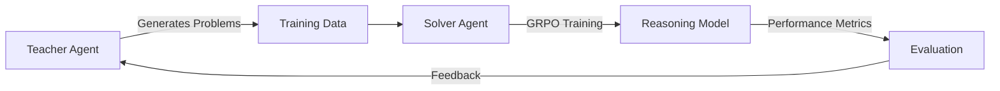

# RZL - R-Zero Lite

**A lightweight implementation of self-evolving reasoning through Teacher-Solver co-evolution**

## Overview

RZL (R-Zero Lite) is a streamlined implementation of the R-Zero paper's self-evolving reasoning system. It trains language models to develop step-by-step reasoning capabilities through a Teacher-Solver co-evolution approach, without requiring pre-existing training data.

### Key Features

- **Self-Bootstrapping**: Generates its own training data from scratch
- **Co-Evolution**: Teacher and Solver agents improve together
- **GRPO Training**: Uses Group Relative Policy Optimization for teaching reasoning
- **Adaptive Difficulty**: Automatically adjusts problem complexity based on performance
- **GGUF Export**: Convert trained models for efficient inference with llama.cpp

## What Makes RZL Special?

Unlike traditional fine-tuning approaches that require large labeled datasets, RZL:

1. **Starts from zero** - No initial training data needed
2. **Teaches reasoning** - Not just pattern matching, but step-by-step problem solving
3. **Evolves continuously** - Both problem generation and solving improve over time
4. **Lightweight** - Runs on a single GPU with 8GB VRAM

## Requirements

- Python 3.11+
- CUDA 12.0+ compatible GPU (8GB+ VRAM recommended)
- Windows/Linux/MacOS
- 16GB+ RAM

## Installation

### 1. Create virtual environment

```bash
python -m venv .venv

# Windows
.venv\Scripts\activate

# Linux/MacOS
source .venv/bin/activate
```

### 2. Install dependencies

```bash
pip install torch torchvision torchaudio --index-url https://download.pytorch.org/whl/cu121
pip install unsloth transformers trl datasets
pip install llama-cpp-python colorama
```

### 3. Download Teacher model

RZL uses a quantized Qwen3-30B model as the Teacher. Download the GGUF file:

```bash
# Create models directory
mkdir -p C:\models\Qwen3-30B

# Download the Q6_K quantized model (or use your preferred source)
# Place it at: C:\models\Qwen3-30B-A3B-Instruct-2507\Qwen3-30B-A3B-Instruct-2507-Q6_K.gguf
```

## Quick Start

### Train your first RZL model

```bash
python rzl/run_rzl.py
```

This will:
1. Initialize Teacher (Qwen3-30B) and Solver (Gemma-3-1B) agents
2. Generate initial training problems
3. Train the Solver with GRPO to learn reasoning
4. Evolve both agents through multiple iterations
5. Save checkpoints after each iteration

### Test the system

```bash
# Test Teacher problem generation
python rzl/tests/test_teacher.py

# Test GRPO training with small dataset
python rzl/tests/test_grpo.py
```

## Training Pipeline



### Evolution Process

1. **Bootstrap Phase**: Teacher generates initial math problems
2. **Training Phase**: Solver learns using GRPO with custom rewards
3. **Evaluation Phase**: Test Solver accuracy on new problems
4. **Evolution Phase**: Teacher adapts prompt based on results
5. **Difficulty Adjustment**: Increase/decrease complexity dynamically

## Interactive Chat

After training, chat with your model:

```bash
# Export to GGUF format
python rzl/helpers/export_to_gguf.py

# Start interactive chat
python rzl/chat_with_gguf.py
```

### Real Example from Trained Model

Here's an actual inference session with a trained RZL model solving a multi-step word problem:


```
You: Michelle buys 3 books for $8.95 each and 2 magazines for $4.50 each. She has a membership
card that gives her a 15% discount on her total purchase. What does she pay after the discount?

Solver: Okay, let's solve this problem step by step.

1. **Calculate the cost of the books:**
   Michelle buys 3 books at $8.95 each, so the cost of the books is 3 × $8.95 = $26.85.

2. **Calculate the cost of the magazines:**
   Michelle buys 2 magazines at $4.50 each, so the cost of the magazines is 2 × $4.50 = $9.00.

3. **Calculate the total cost before the discount:**
   The total cost of the books and magazines is $26.85 + $9.00 = $35.85.

4. **Calculate the discount amount:**
   Michelle receives a 15% discount on her total purchase, so the discount amount is 0.15 × $35.85 = $5.3775.
   Since we're dealing with money, we should round this to the nearest cent.

5. **Calculate the final price after the discount:**
   Subtract the discount amount from the total cost: $35.85 - $5.3775 = $30.4725.
   Rounding to the nearest cent, the final price is $30.47.

</start_working_out>
<SOLUTION>The final price Michelle pays after the discount is $30.47.</SOLUTION>
```

This demonstrates the model's ability to:
- Break down complex multi-step problems
- Track multiple quantities (books, magazines, prices)
- Apply percentage calculations correctly
- Handle currency rounding appropriately
- Present clear, step-by-step reasoning

## Configuration

### Training Parameters

Edit `run_rzl.py` to customize:

```python
# Model settings
TEACHER_MODEL = "path/to/your/teacher.gguf"
SOLVER_MODEL = "unsloth/gemma-3-1b-it-bnb-4bit"

# Training configuration
GRPO_STEPS = 100
LEARNING_RATE = 1e-6
BATCH_SIZE = 4
MAX_SEQ_LENGTH = 256

# Evolution settings
NUM_ITERATIONS = 10
PROBLEMS_PER_ITERATION = 50
TARGET_ACCURACY = 0.65
```

### Reward Functions

RZL uses four reward components:
- **Format Match**: Correct reasoning structure
- **Answer Check**: Mathematical correctness
- **Number Extract**: Proper numerical extraction
- **Approximate Format**: Partial credit for attempts

## Project Structure

```
rzl/
├── run_rzl.py                 # Main training pipeline
├── test_grpo.py              # GRPO testing utilities
├── test_teacher.py           # Teacher testing utilities
├── export_to_gguf.py         # Model export tool
├── chat_with_gguf.py         # Interactive chat interface
├── setup_llama_cpp.py        # GGUF tools setup
├── qwen3_nonthinking.jinja   # Chat template
├── loralab/
│   └── utils/
│       └── cli_formatter.py  # Synthwave UI utilities
└── outputs/
    ├── solver/               # Training checkpoints
    └── gguf/                 # Exported models
```

## Advanced Usage

### Custom Teacher Models

```python
# Use your own GGUF model
teacher = TeacherAgent(
    model_path="path/to/your/model.gguf",
    n_ctx=8192,
    n_gpu_layers=-1
)
```

### Export Options

```bash
# Different quantization levels
python export_to_gguf.py --quantization q8_0  # Best quality
python export_to_gguf.py --quantization q6_k  # Balanced
python export_to_gguf.py --quantization q4_k_m  # Smallest
```

## Citations

RZL is based on the R-Zero paper:

```bibtex
@article{rzero2024,
  title={R-Zero: Teaching Reasoning Through Reverse Self-Play},
  author={...},
  journal={arXiv preprint},
  year={2024}
}
```

## License

This project is licensed under the MIT License - see the LICENSE file for details.

## Acknowledgments

- **Unsloth** for efficient LoRA training
- **llama.cpp** for GGUF inference
- **Anthropic** for Claude's assistance
- **R-Zero authors** for the original paper

## Tips

1. **Start small**: Test with 10-20 problems first
2. **Monitor rewards**: Ensure all reward components are improving
3. **Save checkpoints**: Iterations are saved automatically
4. **Experiment**: Try different Teacher models and prompts
