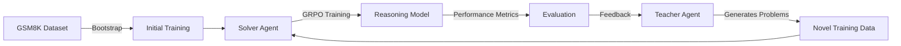

# RZL - R-Zero Lite

**A lightweight implementation of self-evolving reasoning through Teacher-Solver co-evolution**

## Overview

RZL (R-Zero Lite) is an R-Zero inspired implementation that trains language models to develop step-by-step reasoning capabilities through a Teacher-Solver co-evolution approach. While the original R-Zero generates training data from scratch, this implementation bootstraps with GSM8K examples for faster convergence, then evolves its own increasingly complex problems.

### Key Features

- **GSM8K Bootstrap**: Uses initial GSM8K examples for format learning, then generates novel problems
- **Co-Evolution**: Teacher and Solver agents improve together through iterative training
- **GRPO Training**: Uses Group Relative Policy Optimization for teaching reasoning
- **Adaptive Difficulty**: Automatically adjusts problem complexity based on performance
- **GGUF Export**: Convert trained models for efficient inference with llama.cpp

## What Makes RZL Special?

Unlike traditional fine-tuning approaches, RZL:

1. **Self-evolves** - After initial bootstrap, generates its own training problems
2. **Teaches reasoning** - Not just pattern matching, but step-by-step problem solving
3. **Adapts dynamically** - Both problem generation and solving improve over time
4. **Lightweight** - Runs efficiently on a single GPU with 16GB VRAM

## Requirements

- Python 3.11+
- CUDA 12.0+ compatible GPU (8GB+ VRAM recommended)
- Windows/Linux/MacOS
- 16GB+ RAM

## Installation

### 1. Create virtual environment

```bash
python -m venv .venv

# Windows
.venv\Scripts\activate

# Linux/MacOS
source .venv/bin/activate
```

### 2. Install dependencies

```bash
pip install torch torchvision torchaudio --index-url https://download.pytorch.org/whl/cu128
pip install unsloth transformers trl datasets
pip install llama-cpp-python colorama
```

### 3. Download Teacher model

RZL uses a quantized Qwen3-30B model as the Teacher. Download the GGUF file:

```bash
# Create models directory
# mkdir -p C:\models\Qwen3-30B-A3B-Instruct-2507\

# Download the Q6_K quantized model (or use your preferred source)
# Place it at: C:\models\Qwen3-30B-A3B-Instruct-2507\Qwen3-30B-A3B-Instruct-2507-Q6_K.gguf
```

## Quick Start

### Train your first RZL model

```bash
python rzl/run_rzl.py
```

This will:
1. Initialize Teacher (Qwen3-30B-A3B-Instruct-2507) and Solver (Gemma-3-1B) agents (change models as desired)
2. Generate initial training problems
3. Train the Solver with GRPO to learn reasoning
4. Evolve both agents through multiple iterations
5. Save checkpoints after each iteration

### Test the system

```bash
# Test Teacher problem generation
python rzl/tests/test_teacher.py

# Test GRPO training with small dataset
python rzl/tests/test_grpo.py
```

## Training Pipeline



### Evolution Process

1. **Bootstrap Phase**: Pre-train on 30 GSM8K examples to learn format (10 steps)
2. **Problem Generation**: Teacher creates 20-55 novel problems per iteration
3. **Training Phase**: Solver learns using GRPO with custom rewards (75 steps/iteration)
4. **Evaluation Phase**: Test Solver accuracy on 10 new problems
5. **Evolution Phase**: Teacher adapts prompt based on results
6. **Difficulty Adjustment**: Increase complexity when accuracy >70%, decrease when <40%

## Interactive Chat

After training, chat with your model:

```bash
# Export to GGUF format
python rzl/helpers/export_to_gguf.py

# Start interactive chat
python rzl/chat_cli.py
```

### Real Example from Trained Model

Here's an actual inference session with a trained RZL model solving a multi-step word problem:


```
You: Michelle buys 3 books for $8.95 each and 2 magazines for $4.50 each. She has a membership
card that gives her a 15% discount on her total purchase. What does she pay after the discount?

Solver: Okay, let's solve this problem step by step.

1. **Calculate the cost of the books:**
   Michelle buys 3 books at $8.95 each, so the cost of the books is 3 × $8.95 = $26.85.

2. **Calculate the cost of the magazines:**
   Michelle buys 2 magazines at $4.50 each, so the cost of the magazines is 2 × $4.50 = $9.00.

3. **Calculate the total cost before the discount:**
   The total cost of the books and magazines is $26.85 + $9.00 = $35.85.

4. **Calculate the discount amount:**
   Michelle receives a 15% discount on her total purchase, so the discount amount is 0.15 × $35.85 = $5.3775.
   Since we're dealing with money, we should round this to the nearest cent.

5. **Calculate the final price after the discount:**
   Subtract the discount amount from the total cost: $35.85 - $5.3775 = $30.4725.
   Rounding to the nearest cent, the final price is $30.47.

</start_working_out>
<SOLUTION>The final price Michelle pays after the discount is $30.47.</SOLUTION>
```

This demonstrates the model's ability to:
- Break down complex multi-step problems
- Track multiple quantities (books, magazines, prices)
- Apply percentage calculations correctly
- Handle currency rounding appropriately
- Present clear, step-by-step reasoning

# Compare with HuggingFace base model (default)
python rzl/chat_cli.py --compare

# Compare with specific HuggingFace model
python rzl/chat_cli.py --compare --base-model unsloth/gemma-3-1b-it

# Or compare with GGUF base model (if you have one)
python rzl/chat_cli.py --compare --base-model outputs/gguf/base_model.gguf

## Configuration

### Training Parameters (Optimized Defaults)

Default settings in `run_rzl.py`:

```python
# Model settings
TEACHER_MODEL = "C:\models\Qwen3-30B-A3B-Instruct-2507\*.gguf"
SOLVER_MODEL = "unsloth/gemma-3-1b-it-bnb-4bit"

# Optimal GRPO configuration
BATCH_SIZE = 4
NUM_GENERATIONS = 4  # Total effective batch = 16
GRPO_STEPS_PER_ITERATION = 75
LEARNING_RATE = 5e-6

# Evolution settings
NUM_ITERATIONS = 8  # Full training cycle
INITIAL_PROBLEMS = 30  # GSM8K bootstrap
PROBLEMS_PER_ITERATION = "20 + (iteration * 5)"  # Scales 20→55
TARGET_ACCURACY_RANGE = "40-70%"  # Sweet spot for difficulty

```

### Reward Functions

RZL uses five reward components for GRPO training:
- **Format Match Exactly**: +3.0 for perfect reasoning structure
- **Format Match Approximately**: +0.5 per format element, +0.5 for correct order
- **Answer Check**: +3.0 for correct answer, partial credit for close answers
- **Number Extract**: +1.5 for correctly extracting numerical answer
- **Length Penalty**: +1.0 for ideal length (30-100 words), penalties for too long

## Project Structure

```
rzl/
├── run_rzl.py                 # Main training pipeline
├── chat_cli.py                # Interactive chat interface
├── qwen3_nonthinking.jinja    # Chat template
├── rzl/
│   ├── agents/
│   │   ├── solver.py
│   │   └── teacher.py
│   ├── evaluation/
│   │   └── evaluation_problems.py 
│   ├── helpers/
│   │   ├── export_to_gguf.py
│   │   └── setup_llama_cpp.py
│   ├── tests/
│   │   ├── test_grpo.py
│   │   └── test_teacher.py
│   └── utils/
│       └── cli_formatter.py   # UI utilities
└── outputs/
    └── [output timestamp]/
        ├── solver/
        └── gguf/
```

## Advanced Usage

### Custom Teacher Models

```python
# Use your own GGUF model
teacher = TeacherAgent(
    model_path="path/to/your/model.gguf",
    n_ctx=8192,
    n_gpu_layers=-1
)
```

### Export Options

```bash
# Different quantization levels
python rzl/helpers/export_to_gguf.py --quantization q8_0  # Best quality
python rzl/helpers/export_to_gguf.py --quantization q6_k  # Balanced
python rzl/helpers/export_to_gguf.py --quantization q4_k_m  # Smallest
```

## Citations

RZL is based on the R-Zero paper:

```bibtex
@article{huang2025rzeroselfevolvingreasoningllm,
      title={R-Zero: Self-Evolving Reasoning LLM from Zero Data}, 
      author={Chengsong Huang and Wenhao Yu and Xiaoyang Wang and Hongming Zhang and Zongxia Li and Ruosen Li and Jiaxin Huang and Haitao Mi and Dong Yu},
      year={2025},
      eprint={2508.05004},
      archivePrefix={arXiv},
      primaryClass={cs.LG},
      url={https://arxiv.org/abs/2508.05004}, 
}
```

## License

This project is licensed under the MIT License - see the LICENSE file for details.

## Acknowledgments

- **R-Zero authors** for the original paper
- **Unsloth** for efficient LoRA training
- **Qwen** for amazing small models
- **Google** for amazing small models
- **DeepSeek** for GRPO
- **llama.cpp** for GGUF inference

## Tips

1. **Start small**: Test with 10-20 problems first
2. **Monitor rewards**: Ensure all reward components are improving
3. **Save checkpoints**: Iterations are saved automatically
4. **Experiment**: Try different Teacher models and prompts
